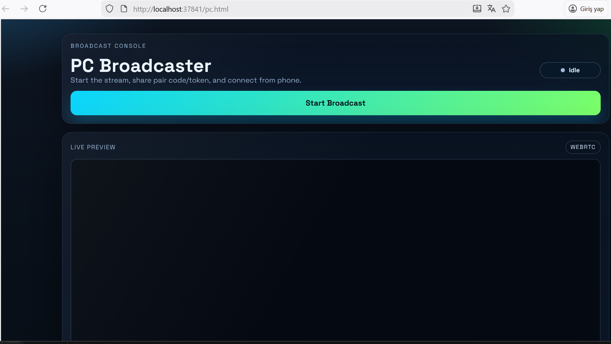
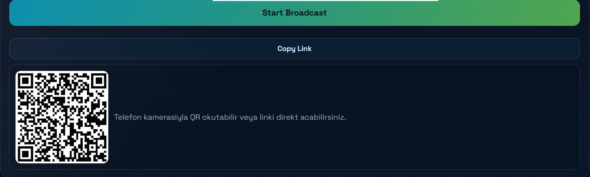
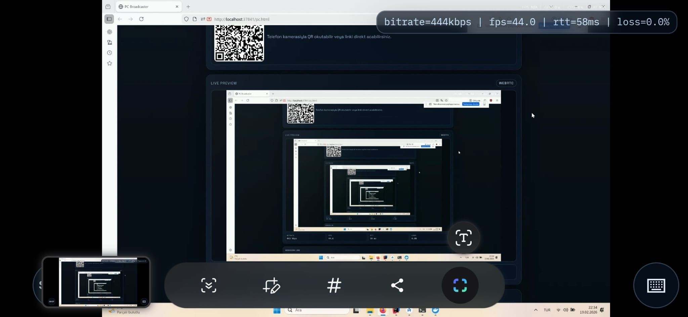
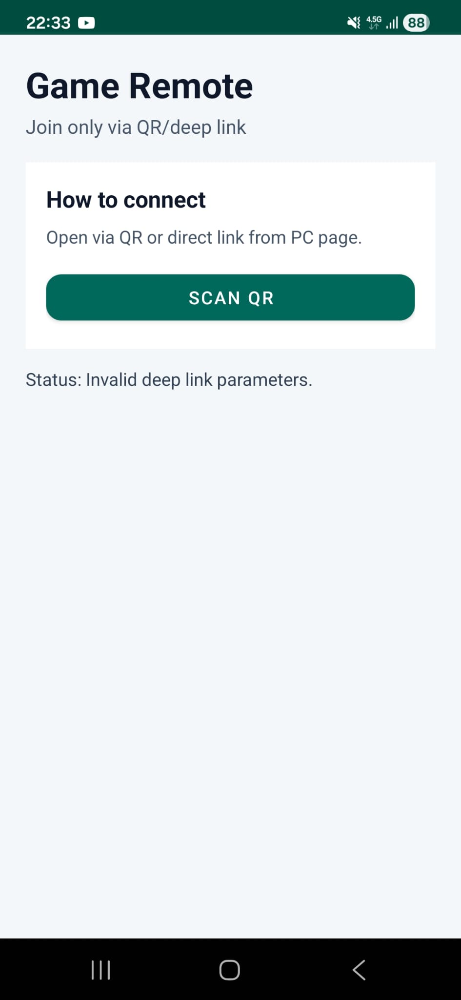

# GameRemoteServer


Backend service for low-latency PC screen streaming to Android with remote input using WebRTC + WebSocket signaling.

## Screenshots

### 1) PC Broadcaster (Idle)



### 2) PC Broadcaster (Pair Ready)



### 3) Android (Connect Flow)



### 4) Android (Live Viewer)



## Architecture Overview

```text
PC Browser (Broadcaster)          Android Web/App (Viewer)
          |                                  |
          |---- WebSocket Signaling (/ws) ---|
          |                                  |
          |===== WebRTC Media/Data Channel ===|
                         |
                         v
                GameRemoteServer (Node.js)
           - Static web client hosting
           - Pair/session management
           - Signaling relay and validation
                         |
                         v
                Windows Input Agent
           (mouse/keyboard injection on host)
```

For internet access, deployment can include:
- `nginx` for reverse proxy and TLS termination
- `coturn` for TURN relay in restrictive NAT/mobile networks
- optional Cloudflare tunnel profile

## Tech Stack

- Node.js (`http`, `ws`) for signaling + static asset delivery
- Browser WebRTC APIs (`RTCPeerConnection`, data channels)
- WebSocket signaling endpoint: `/ws`
- HTML/CSS/JS clients in `web-client/`
- Android native wrapper (WebView + QR flow) in `android-client/`
- Docker + Docker Compose for local/prod orchestration
- Nginx + Coturn for production-grade connectivity

## How to Run

## Local Development

1. Install dependencies:

```bash
npm install
```

2. Start backend:

```bash
npm start
```

3. Start host input agent on the Windows game PC:

```bash
npm run pc:agent
```

4. Open:
- PC broadcaster: `http://localhost:37841/pc.html`
- Android viewer: `http://localhost:37841/android.html`

## Docker (Local)

Start app stack:

```bash
docker compose -f docker-compose.yml up -d --build
```

Or use helper scripts:

```bash
npm run up:all
npm run down:all
```

## Production (Docker + Nginx + TURN)

1. Create env:

```bash
cd deploy
cp .env.prod.example .env.prod
```

2. Fill `.env.prod` (domain + TURN values).

3. Run:

```bash
docker compose --env-file .env.prod -f docker-compose.prod.yml up -d --build
```

4. Access:
- `https://<DOMAIN>/pc.html`
- `https://<DOMAIN>/android.html`

## Sample API Calls

## 1) Get active pair metadata

Returns active code, ICE config, and server reachability hints.

```bash
curl -s http://localhost:37841/api/pair
```

Example response:

```json
{
  "code": "395575",
  "waitTimeoutMs": 180000,
  "serverIps": ["192.168.1.3"],
  "preferredIp": "192.168.1.3",
  "publicBaseUrl": "https://example.com",
  "iceServers": [{"urls":"stun:stun.l.google.com:19302"}]
}
```

## 2) WebSocket signaling registration

Connect to:

```text
ws://localhost:37841/ws
```

Register as PC:

```json
{"type":"register","role":"pc","code":"395575","token":"5E3B9F15AABBCCDD"}
```

Forward SDP/ICE:

```json
{
  "type":"signal",
  "token":"5E3B9F15AABBCCDD",
  "target":"android",
  "data":{"sdp":{"type":"offer","sdp":"..."}}
}
```

## Design Decisions

- WebSocket is used only for signaling/control, while media flows via WebRTC for lower latency.
- Pair sessions are short-lived with timeout and rotation to reduce stale-session hijacking risk.
- Pair `token` is generated on the PC client side and not exposed via `/api/pair`.
- Server validates role/code/token/target on every signaling action.
- Input injection is separated into a host-only agent for least privilege in server containers.
- Runtime ICE config (`STUN_URLS`, `TURN_*`, `ICE_SERVERS_JSON`) keeps deployment flexible.

## Future Improvements

- Add authenticated PC session ownership (admin secret or signed claims) for stronger pairing control.
- Add rate limiting and abuse protection for `/ws` and `/api/pair`.
- Add structured metrics endpoint (Prometheus) for bitrate/RTT/session counts.
- Add integration tests for reconnect, pair-expiry, and token-rotation flows.
- Add CI pipeline for lint/build/test and container scanning.
- Add multi-viewer or observer mode with role-based permissions.
